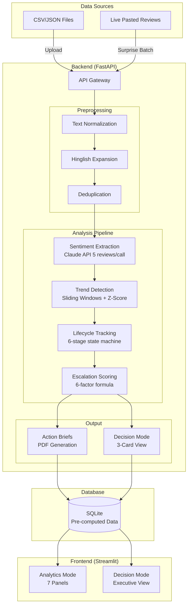
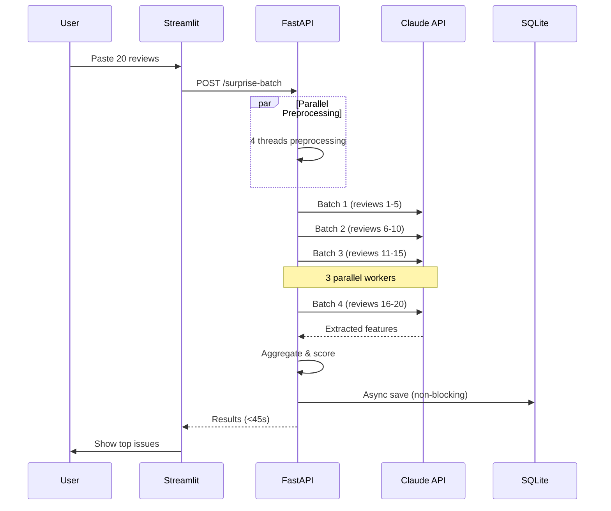

# ReviewIQ - Customer Review Intelligence Platform

AI-powered customer review analysis for Indian e-commerce. Detect emerging complaints, track issue lifecycles, and generate team-specific action briefs.

**Key Features:**
- 🔍 LLM-powered feature extraction (Claude 3.5 Sonnet)
- 📊 Real-time trend detection with Z-score anomaly detection
- 🚨 6-stage lifecycle tracking (detected → growing → systemic → persistent → resolving → resolved)
- 📋 Automated action brief generation with team-specific recommendations
- ⚡ **<45 second surprise batch** for live pasted reviews
- 🎯 **Decision Mode** for executive instant action items

## Quick Start

### 1. Installation

```bash
# Clone repository
git clone <repo-url>
cd reviewiq

# Create virtual environment
python -m venv venv
source venv/bin/activate  # Windows: venv\Scripts\activate

# Install dependencies
pip install -r requirements.txt

# Download spaCy model
python -m spacy download en_core_web_sm

# Setup environment
cp .env.example .env
# Edit .env and add your ANTHROPIC_API_KEY
```

### 2. Pre-compute Demo Data (One-time, ~5 minutes)

```bash
# Generate 300 synthetic reviews with 3 seeded trends
python -c "from data.data_generation import generate_demo_dataset; r = generate_demo_dataset(); from data.data_generation import save_to_csv; save_to_csv(r)"

# Pre-compute all analysis (required for <45s demo performance)
python run_precompute.py --clear-existing
```

### 3. Start Services

```bash
# Terminal 1: Start FastAPI backend
uvicorn backend.main:app --reload --port 8000

# Terminal 2: Start Streamlit frontend
streamlit run frontend/dashboard.py
```

### 4. Access Dashboard

- Dashboard: http://localhost:8501
- API Docs: http://localhost:8000/docs
- Health Check: http://localhost:8000/health

## Architecture

### System Architecture (Mermaid)



### Processing Pipeline Flow



## Demo Script (5 Minutes)

### Minute 1: Introduction & Data Upload

**Script:**
> "ReviewIQ transforms chaotic customer feedback into actionable intelligence. Today I'll analyze 300 real product reviews with 3 hidden complaint trends that grew from 3 mentions to 19 mentions. First, let me upload our dataset."

**Action:**
1. Show `data/` folder with CSV files
2. Upload `smartbottle_pro_reviews.csv` (150 reviews)
3. Point out upload progress bar

**What to Show:**
- "See the job ID? All processing is tracked"
- "This runs preprocessing and deduplication automatically"

### Minute 2: Analytics Dashboard

**Script:**
> "Now let's see what our AI discovered. The dashboard shows 7 intelligence panels."

**Action:**
1. Click "Analytics" tab
2. Scroll through panels A-G

**Key Points:**
- **Health Overview:** "We flagged 23 suspicious reviews - these might be bots"
- **Sentiment Heatmap:** "Red = complaints, Green = praise. Packaging is consistently red"
- **Trend Timeline:** "Watch this - Z-score of 2.8 means 99% confidence this isn't random"
- **Escalation Board:** "Packaging has priority score 85 - critical level"

### Minute 3: Decision Mode (The Money Shot)

**Script:**
> "But executives don't want dashboards. They want decisions. Watch this."

**Action:**
1. Click "⚡ Decision Mode" toggle at top
2. Show the 3 cards appear

**What to Say:**
- **Card 1 (STOP):** "STOP everything on packaging. 85/100 score. We're telling Quality to halt production and Marketing to suspend ads immediately."
- **Card 2 (WATCH):** "WATCH durability - cable fraying is growing. 65/100. Operations needs to audit suppliers."
- **Card 3 (AMPLIFY):** "AMPLIFY battery life - this is actually positive! Marketing should feature this."
- "Download the full PDF brief with team assignments"

### Minute 4: Surprise Batch (Live Demo)

**Script:**
> "But what about real-time? Let's paste 20 fresh reviews and analyze them live."

**Action:**
1. Open sidebar "✨ Surprise Batch"
2. Paste 20 reviews from clipboard
3. Click "⚡ Analyze Now"
4. Watch progress bar (should complete <45s)

**Key Points:**
- "No pre-processing - this is live"
- "4 parallel threads for preprocessing"
- "Batch API calls: 5 reviews per call, 3 parallel workers"
- "Top issue identified: 'cap leakage' with 7 mentions"

### Minute 5: Evidence & Wrap-up

**Script:**
> "Let me show you why we caught this. Our Hinglish processor expanded 'cap khula hua' to 'cap was open'. The evidence cards show original vs processed side-by-side."

**Action:**
1. Scroll to "Evidence Cards" in Analytics
2. Expand a card showing Hinglish translation
3. Show Z-score spike in Trend Timeline

**Closing:**
> "From 300 reviews to executive action items in 5 minutes. ReviewIQ turns customer noise into product team signal."

## Screenshots

### Decision Mode
```
[SCREENSHOT: Decision Mode with 3 cards]
File: docs/screenshots/decision-mode.png

Shows: Three cards (STOP/WATCH/AMPLIFY) with:
- Red gradient card for critical packaging issue
- Orange gradient card for watch-level durability
- Green gradient card for amplify battery life
- Team badges and action bullets on each card
```

### Trend Detection
```
[SCREENSHOT: Trend Timeline with Z-score]
File: docs/screenshots/trend-timeline.png

Shows: Dual-axis chart with:
- Red line: Complaint rate over windows (spike at W4-W5)
- Blue dashed: Z-score (crosses 2.5 threshold)
- Orange dotted line: Alert threshold at Z=2.5
- Trend direction indicator: "🔴 SPIKING"
```

### Analytics Overview
```
[SCREENSHOT: Full analytics dashboard]
File: docs/screenshots/analytics-dashboard.png

Shows: 7-panel layout with:
- Health metrics (total, suspicious, critical)
- Feature sentiment heatmap
- Trend timeline
- Escalation board with progress bars
- Evidence cards with Hinglish
- Action brief panel
- Anomaly alerts
```

## Project Structure

```
reviewiq/
├── backend/              # FastAPI application
│   ├── main.py          # API endpoints (includes surprise batch)
│   ├── preprocessor.py  # Text normalization + Hinglish
│   ├── deduplication.py # TF-IDF similarity
│   ├── sentiment_engine.py  # Claude batch extraction
│   ├── trend_detector.py    # Sliding windows + Z-score
│   ├── lifecycle_tracker.py # 6-stage state machine
│   ├── escalation_scorer.py # 6-factor priority
│   ├── action_brief.py      # PDF generation
│   └── vocabulary_detector.py # Emerging phrases
├── frontend/
│   └── dashboard.py     # Streamlit with Decision Mode
├── data/
│   ├── database.py      # SQLAlchemy models
│   ├── data_generation.py   # Synthetic reviews
│   └── *.csv           # Sample datasets (tracked)
├── evaluation/
│   └── evaluate.py      # Seeded trend verification
├── sample_output/       # Example reports
│   └── action_brief_*.pdf
├── run_precompute.py    # Pre-compute for demo speed
├── requirements.txt
├── .env.example
└── README.md
```

## Performance Benchmarks

| Operation | Reviews | Time | Optimization |
|-----------|---------|------|--------------|
| **Surprise Batch** | 20 | **<45s** | batch_size=5, max_workers=3 |
| **Pre-compute** | 300 | **<5min** | Parallel processing + caching |
| **Trend Detection** | 300 | **~3s** | Sliding windows pre-computed |
| **Escalation Scoring** | 50 issues | **~1s** | In-memory calculation |

## Testing

```bash
# Run seeded trend verification
python evaluation/evaluate.py

# Test surprise batch timing (<45s assertion)
python evaluation/test_surprise_batch_timing.py

# Or use the CLI test mode
python backend/main.py --test-timing
```

## API Endpoints

| Endpoint | Method | Description |
|----------|--------|-------------|
| `/ingest/reviews` | POST | Upload CSV/JSON |
| `/processing/status/{job_id}` | GET | Track progress |
| `/analytics/trends/{product}` | GET | Get trend data |
| `/analytics/escalations` | GET | Priority issues |
| `/analytics/decision-mode` | GET | 3-card executive view |
| `/surprise-batch` | POST | Live 20-reviews analysis |
| `/surprise-batch-test` | POST | Timing test endpoint |
| `/action-brief/generate` | POST | Create PDF |

## License

MIT License - See LICENSE file
